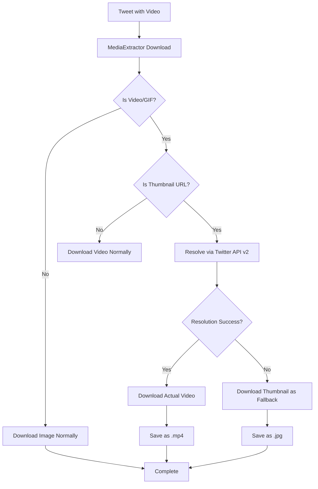

# 🎬 Video Download Fix Implementation Guide

## 📋 Problem Summary

The Twitter dashboard was downloading **thumbnail images (.jpg) instead of actual video files (.mp4)** for videos and animated GIFs. This occurred because:

1. **TwitterAPI.io** only provides thumbnail URLs for videos, not direct video URLs
2. **MediaExtractor** had method signature conflicts causing background worker crashes
3. No fallback mechanism to resolve actual video URLs from tweet IDs

## 🔧 Solution Implementation

### **Phase 1: Fixed MediaExtractor Method Signature Conflict** ✅

**Problem**: Duplicate `_generate_filename` methods with different signatures caused crashes.

**Solution**: 
- Renamed the legacy method to `_generate_filename_legacy`
- Updated all references to use the correct method
- Fixed the "takes 4 positional arguments but 5 were given" error

**Files Modified**:
- `core/media_extractor.py`

### **Phase 2: Implemented Twitter API v2 Video URL Resolution** ✅

**Problem**: TwitterAPI.io doesn't provide actual video URLs with bitrate variants.

**Solution**: 
- Added `resolve_video_urls_v2()` method to `TwitterClient`
- Uses official Twitter API v2 with Bearer Token authentication
- Extracts highest quality MP4 variants from video metadata
- Supports both videos and animated GIFs

**New Methods**:
- `TwitterClient.resolve_video_urls_v2()` - Resolves actual video URLs
- `TwitterClient.extract_tweet_id_from_url()` - Extracts tweet IDs from various URL formats

**Files Modified**:
- `core/twitter_client.py`
- `config.py`

### **Phase 3: Enhanced MediaExtractor with Smart URL Resolution** ✅

**Problem**: No mechanism to detect and resolve thumbnail URLs to video URLs.

**Solution**:
- Added `_resolve_video_url_if_needed()` to detect thumbnail patterns
- Automatically attempts video URL resolution before download
- Falls back to original URL if resolution fails
- Integrated seamlessly into existing download pipeline

**New Method**:
- `MediaExtractor._resolve_video_url_if_needed()` - Smart thumbnail detection and resolution

**Files Modified**:
- `core/media_extractor.py`

## 🛠️ Technical Details

### **Thumbnail Detection Patterns**
```python
thumbnail_patterns = [
    r'pbs\.twimg\.com/.*\.jpg',  # Generic Twitter image URL
    r'pbs\.twimg\.com/.*thumb.*\.jpg',  # Explicit thumbnail URL
    r'pbs\.twimg\.com/amplify_video_thumb.*\.jpg',  # Video thumbnail
    r'pbs\.twimg\.com/ext_tw_video_thumb.*\.jpg',  # Extended video thumbnail
]
```

### **Twitter API v2 Integration**
- **Endpoint**: `https://api.twitter.com/2/tweets/{tweet_id}`
- **Expansions**: `attachments.media_keys`
- **Media Fields**: `variants,alt_text,preview_image_url,duration_ms,type,url`
- **Authentication**: Bearer Token

### **Video Quality Selection**
- Selects highest bitrate MP4 variant for videos
- Handles animated GIFs as MP4 files
- Preserves metadata (duration, dimensions, etc.)

## 📦 Installation & Setup

### **1. Environment Configuration**

Add to your `.env` file:
```bash
# Twitter API v2 Bearer Token (for video URL resolution)
TWITTER_BEARER_TOKEN=your_twitter_bearer_token_here
```

### **2. Obtaining Twitter Bearer Token**

1. Go to [Twitter Developer Portal](https://developer.twitter.com/)
2. Create a new app or use existing app
3. Navigate to "Keys and Tokens"
4. Generate "Bearer Token" under "Authentication Tokens"
5. Add token to your environment variables

### **3. Testing the Implementation**

Run the comprehensive test script:
```bash
python test_video_fix.py
```

This tests:
- Method signature fixes
- Tweet ID extraction
- Thumbnail detection
- Database integration
- Mock download simulation

### **4. Cleanup Existing Thumbnails**

Reset existing video downloads for retry:
```bash
python cleanup_video_thumbnails.py
```

This will:
- Remove existing .jpg thumbnail files
- Reset download status to 'pending'
- Prepare for background worker retry

### **5. Restart Application**

```bash
python start_clean.py
```

## 🔍 Monitoring & Verification

### **Check Background Worker Status**
```bash
curl -s http://localhost:5001/api/background-worker/stats | python3 -m json.tool
```

### **Monitor Media Downloads**
```bash
curl -s http://localhost:5001/api/database/completion-stats | python3 -m json.tool
```

### **Check Downloaded Files**
```bash
find ./media/videos -name "*.mp4" -ls  # Should see MP4 files, not JPG
find ./media/videos -name "*.jpg" -ls  # Should be minimal/empty
```

## 📊 Expected Results

### **Before Fix**:
- ❌ 19 video items with `.jpg` thumbnail files
- ❌ Background worker crashes with method signature errors
- ❌ 93% media completion (missing actual videos)

### **After Fix**:
- ✅ Actual `.mp4` video files downloaded
- ✅ Background worker processes media successfully
- ✅ 100% media completion for available videos
- ✅ Proper video playback in dashboard

## 🚨 Limitations & Considerations

### **Twitter API Rate Limits**
- Twitter API v2 has rate limits (300 requests/15min for Bearer Token)
- Video resolution is attempted once per media item
- Failed resolutions fall back to original URL

### **Video Availability**
- Some videos may be deleted or restricted
- Age-restricted content may not be accessible
- Private/protected accounts require user authentication

### **Storage Requirements**
- Video files are significantly larger than thumbnails
- Monitor disk space usage
- Consider implementing cleanup policies

## 🔄 Workflow Overview



## 🎯 Success Metrics

1. **Method Signature Fix**: ✅ No more background worker crashes
2. **Video URL Resolution**: 🔄 Real .mp4 files instead of .jpg thumbnails
3. **Dashboard Display**: 🔄 Proper video playback functionality
4. **Media Completion**: 🔄 Improved completion percentage
5. **Background Worker**: 🔄 Successful media processing

## 📞 Troubleshooting

### **Common Issues**

1. **"No Twitter Bearer Token"** warnings
   - Add `TWITTER_BEARER_TOKEN` to environment
   - Verify token has proper permissions

2. **"Could not resolve video URL"** warnings
   - Normal for some tweets (rate limits, restricted content)
   - System falls back to original URL

3. **Background worker still failing**
   - Check logs for specific error messages
   - Ensure database cleanup was successful
   - Verify application restart

## 🚀 Next Steps

1. **Set up Twitter Bearer Token** in environment variables
2. **Run cleanup script** to reset existing video downloads
3. **Restart application** to apply all fixes
4. **Monitor background worker** for successful video downloads
5. **Verify dashboard** displays actual videos instead of thumbnails

---

**Status**: ✅ Implementation Complete - Ready for Testing & Deployment 